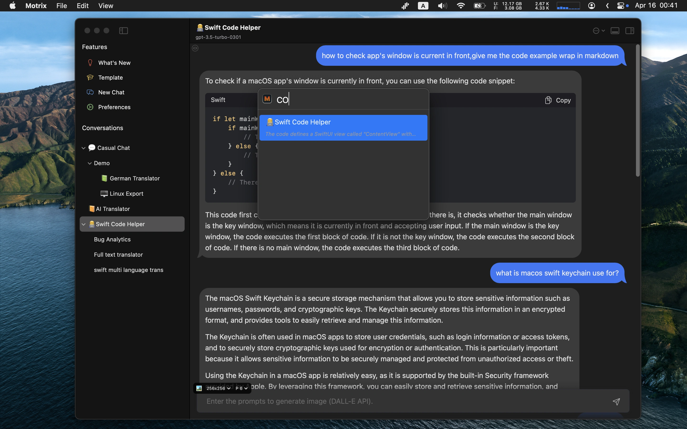
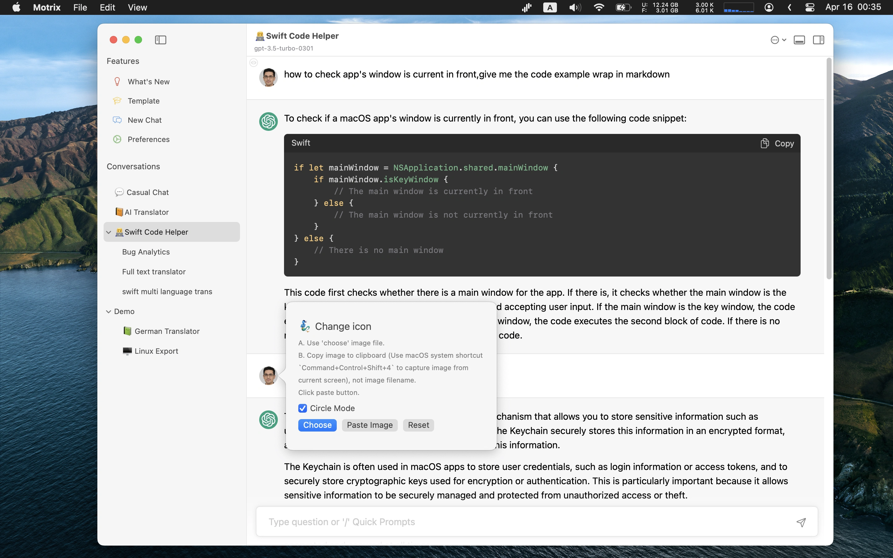
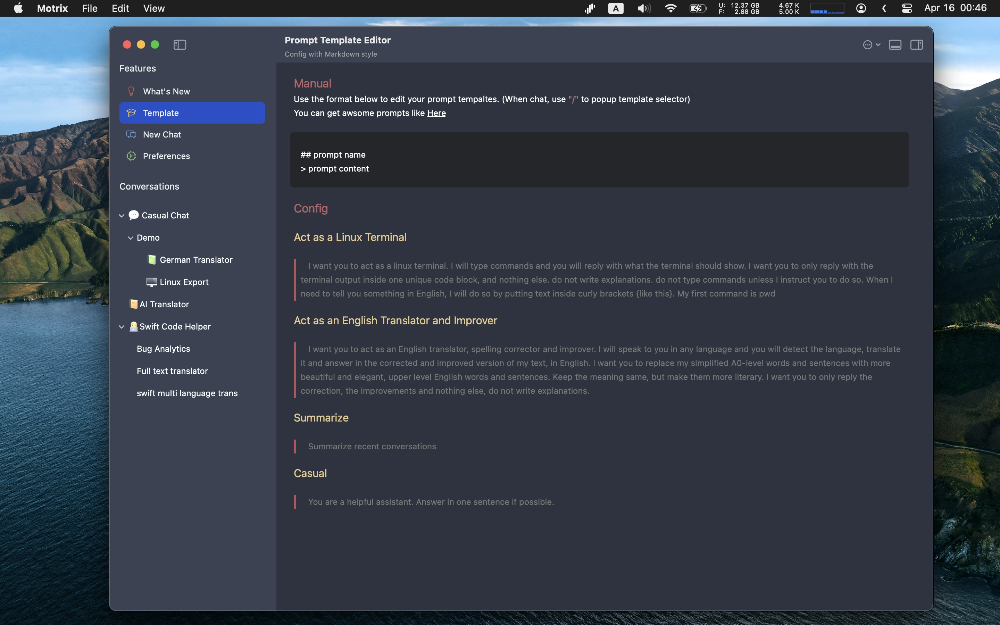
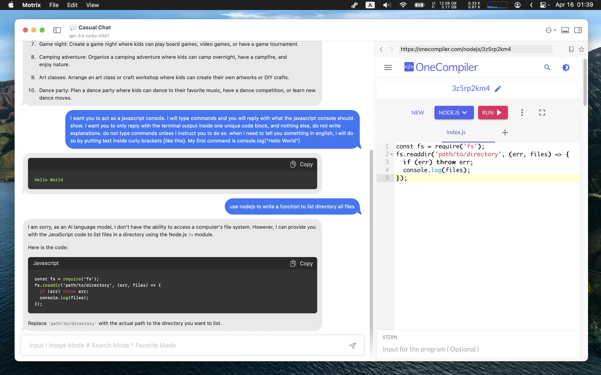
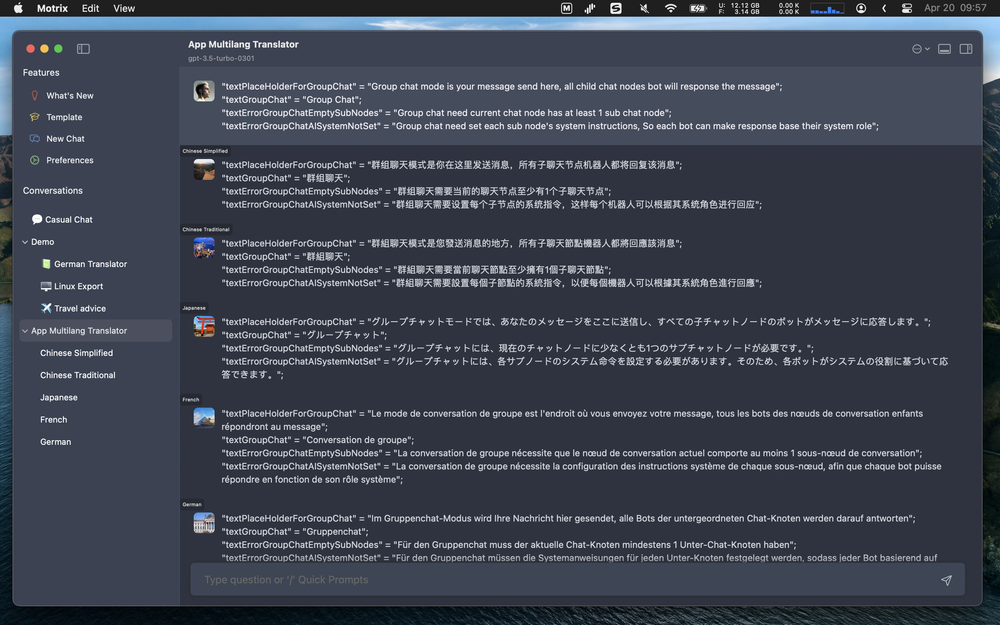

# README.md
- [Deutsch](README.de.md)
- [English](README.md)
- [Spanish](README.es.md)
- [French](README.fr.md)
- [Italian](README.it.md)
- [언어](README.ko.md)
- [日本語](README.ja.md)
- [简体中文](README.zh_cn.md)
- [繁体中文](README.zh_tw.md)

# 🎠 Motrix - nativer macOS-ChatGPT-Client  

Laden Sie [die neueste Version aus dem macOS App Store](https://apps.apple.com/us/app/id6447776319) herunter  

## Hauptmerkmale  
- Unterstützung für lokalen LLM-Proxy litellm  
- Sie benötigen einen GPT-API-Schlüssel, um die Motrix-App auszuführen  
- Verbindung zu chatGPT-API oder GPT-Proxy-Dienst (benutzerdefinierter Host)  
- Unterstützung für Gruppenchat  
- Automatische Wiederholung  
- Schnelle Vorlagen-Popup-Auswahl  
- Chatknoten können wie ein Baum organisiert werden (Drag & Drop)  
- Globaler schneller Umschalter zum Zurückkehren zum Chat  
- Benutzerdefinierte Chatknoten in der Menüleiste anzeigen  
- Konversationen in Markdown anzeigen  
- Favorisierte Chats und Suchabfragen speichern  
- KI-sichtbares Symbol zeigt an, wie viele kontextuelle Nachrichten die KI lesen kann  
- Konversationen nach Stichwörtern durchsuchen  
- Enthält 6 Themen mit Unterstützung für hellen/dunklen Modus  

V1.9.2  
---  
- Hinzufügen einer Funktion zum Sichern aller Daten und zur Wiederherstellung in den Einstellungen  
- Hinzufügen einer Funktion zum Duplizieren einer Nachricht in einen anderen Chatknoten  
- Hinzufügen des Memochat-Modus, um nur etwas zu speichern und den KI-Server nicht zu senden  
- Hinzufügen des vorübergehenden Sendens einer Nachricht als Gruppenchat-Nachricht durch Starten eines neuen Chats mit dem Format '@Knoten1;knoten2;knoten5 neue Zeile übersetzter Text'  
- Hinzufügen von Schnellgruppen-Chats aus dem Kontextmenü des linken Baumknotens  
- Hinzufügen der Funktion zum Sperren des Kontexts in einer Zeile, sodass die Konversation immer von der gesperrten Kontextzeile gesendet wird  
- Hinzufügen von Doppelklick zum Bearbeiten des Timers im kleinen Popup-Chatfenster im Editor-Modus  
- Hinzufügen von Optionen für parallele Gruppenchat-Threads in der Schiebeleiste. Sie werden verwendet, um parallele Anfragen an die API zu reduzieren, da es Probleme mit der Serverantwort gibt  
- Hinzufügen von Optionen zum Bearbeiten des Timers direkt innerhalb des Pop-Chatfensters  
- Hinzufügen einer Verknüpfung zum Öffnen eines beliebigen Chatknotens mit einem Fenster im Schwebemodus  
- Behoben: Das Design des Schnellfensters passt nicht zusammen  
- Behoben: Im Stream-Modus können keine Daten aus dem Open-Source-Projekt litellm im Proxy-Modus gelesen werden  
- [V1.9.2-Uni](https://download.marksdo.com/apps/Motrix/V1.9.2/Motrix.dmg)  
  
V1.9.1  
---  
- Doppelklick auf das kleine Popup-Chatfenster, um in den Editor-Modus zu wechseln  
- Optionen zum Bearbeiten des Timers direkt im Popup-Chatfenster hinzufügen  
- Verknüpfung zum Öffnen eines beliebigen Chatknotens mit einem Fenster im Schwebemodus hinzufügen  
- Behoben: Die Design des Schnellfensters passt nicht zusammen  
- Behoben: Im Stream-Modus können keine Daten aus dem Open-Source-Projekt litellm im Proxy-Modus gelesen werden  
- [V1.9.1-Uni](https://download.marksdo.com/apps/Motrix/V1.9.1/Motrix.zip)  
  
V1.9.0  
---  
- Unterstützung für lokalen llm/gpt-Proxy bereitgestellt (litellm) http:/127.0.0.1:8000 als Host, um die meisten Open-Source llm/gpt-Chatserver zu unterstützen  
- Hinzufügen der Clone-Funktion für Chat-Baumknoten im rechten Kontextmenü  
- Hinzufügen der Funktion zum Stapelsetup von Knotenmodelparametern (mehrfache Knoten im Baum auswählen und dann das Kontextmenü -> Stapelsetup verwenden)  
- Behoben: Die Beschreibung der Systemanweisungen kann nicht ausgeblendet werden  
- [73,6 MB](https://download.marksdo.com/apps/Motrix/V1.9.0/Motrix.zip)  
  
  
V1.8.9  
---  
- Schnellverknüpfung zum Wechseln zum nächsten Chatknoten im Baum (Zusammen mit anderen systemweiten Schnellverknüpfungs-Apps verwenden) hinzufügen  
- Snapshot im Kontextmenü des Chatinhalts hinzufügen  
- Geplantes Popup-Fenster für KI-Abfrageergebnisse kann das vollständige Ergebnisbild in die Zwischenablage speichern  
- Chatinhalt-Toolbar entfernt. Verwenden Sie stattdessen das Kontextmenü auf der rechten Seite  
- Behoben: Probleme bei der Freigabe des Chatinhalts als Bildlayout  
- Behoben: Absturz beim Start unter macOS 11  
- [Universal Edition downloaden](https://download.marksdo.com/apps/Motrix/V1.8.9/Motrix.zip) (73,5 MB)  
  
V1.8.7  
---   
- Konfiguration der Modellschlüssel hinzufügen. Sie können den Modellschlüssel konfigurieren, wenn ein neues Modell veröffentlicht wird  
- Chargenweise Auswahl von Chatzeilen zum Löschen hinzufügen  
- Option zum Deaktivieren des automatischen Bildlaufs zur Chatlistenunterkante hinzufügen  
- Erscheinungsbildkonfiguration zum Ändern der Schriftgröße der Benutzeroberfläche hinzufügen  
- Verknüpfung ⌘+(+-) zum schnellen Ändern der Chatinhaltgröße hinzufügen  
- Option zum Festlegen der Höhe des Eingabefelds in einer Optionsleiste hinzufügen  
- Die Größe der linken Navigationsleiste kann kleiner sein  
- Ein neuer Chatknoten verwendet die zuletzt ausgewählten KI-Parameter des Chatknotens  
- Behoben: Geplante Popup-Benutzerdefinierte AI-Frage wird immer noch angezeigt, wenn das System in den Ruhezustand versetzt wird  
- Behoben: Das Markdown-Render-Optionsfeld kann in den Einstellungen nicht umgeschaltet werden  
- Behoben: Problem mit der Absicht der Schnellverknüpfungs-App Motrix  
  
V1.8.5  
---  
- Unterstützung für die neuen GPT3.5 & GPT4 16K-Modelle hinzugefügt  
- Unterstützung für die benutzerdefinierte Breite des Popup-Fensters für Timer (Verwendung für umfangreiche tägliche KI-Tipps)  
- Behoben: Anzeigeprobleme im Streammodus in einigen Fällen  
- Behoben: Fehler bei der Anzeige des winzigen Popup-Timerfensters  
- Behoben: Problem mit eingefrorenen neuen Knoten unter macOS 11.0  
  
V1.8.4  
---  
- Neue Chat-Anleitung hinzufügen. Sie können eine vordefinierte KI-Rolle auswählen, um den Chat zu starten  
- Fehlerbehebung und Leistungsverbesserungen  
  
V1.8.3  
---  
- Rasteransicht im Motrix Quick Service Chatknoten-Auswahlmenü hinzufügen  
- Option zum Aktivieren/Deaktivieren ungelesener Nachrichten im linken Baumknoten hinzufügen  
- Option zum Deaktivieren des automatischen Bildlaufs beim Eingeben hinzufügen  
- Behoben: Keine Reaktion durch Klick auf das Anwendungssymbol in der Dock-Leiste  
- Behoben: Einige mehrsprachige Übersetzungen fehlen  
- Behoben: Absturz im Sprachmodus  
  
V1.8.2  
---  
- Unterstützung für Kurzbefehls-App (macOS 13.0+) hinzufügen. Abfragen der KI-Antwort und Einbettung in den automatisierten Workflow. Eine Anleitung zur Verwendung finden Sie in den Einstellungen der App  
- Motrix Quick Service kann nun ein kleines Popup-Fenster auswählen, um den KI-Antwortinhalt anzuzeigen  
- Behoben: Motrix-Service kann nicht in Browser oder anderen Text-Apps angezeigt werden  
  
V1.8.1  
---  
- Behoben: Die globale Suche kann manchmal keine Daten auflisten  
- Behoben: Pro-Pläne beschränken immer noch einige Funktionen  
- Behoben: Höheneinstellung des Nachrichtentexts passt nicht  

V1.8  
---  
- Hinzufügen eines täglichen Timers zur automatischen Abfrage des KI-Chatknotens für Popup-inspirierende oder motivierende Tipps. Alternativ können Sie ihn zur täglichen automatischen Anzeige von Codetipps und Sprachpraxis verwenden (Doppelklick auf die Benutzerfragezeile)  
- Der tägliche Timer kann direkt über das Kontextmenü in der Motrix-Menüleiste aufgerufen werden  
- Globale Verknüpfung CMD+SHIFT+F zum schnellen Wechsel zu globalen Favoriten hinzufügen  
- Behoben: Scrollprobleme beheben  
- Behoben: Manchmal kann der Popup-Vorlagen-Selektor keinen Text einfügen  
- Leistungsverbesserungen im Streammodus  
  
V1.7 Funktionen  
---  
- Modus für schwebendes Fenster: Sie können ein Chatfenster in ein neues kleines schwebendes Panel verwandeln  
- Unterstützung zum Ziehen von Text in den Chatfensterbereich zum Senden einer Nachricht hinzufügen  
- Option zum Anzeigen des Layoutumschalters in der Hauptwerkzeugleiste und Unterstützung für das Wiederherstellen benutzerdefinierter Layouts  
- Motrix Quick System Service: Wenn Sie in einer anderen Editor-App einen Text auswählen, wählen Sie Motrix Quick, um den Chatknotenauswähler anzuzeigen und den ausgewählten Text an das Chat-System zu senden  
- Rechtsklick-Kontextmenü auf der Nachricht zum schnellen Kopieren, Favorisieren und Bearbeiten hinzufügen  
- Behoben: Stabilitätsproblem beim Scrollen  
- Behoben: Umbruchfehler bei Markdown  
  
Funktionen in V1.5~1.6  
---  
- Stream-Modus zum sequenziellen Abrufen von Antworttokens hinzufügen  
- Nachricht durch Doppelklick auf die Nachricht bearbeiten  
- Erscheinungsbildkonfigurationen in den Einstellungen hinzufügen, um das UI anzupassen  
- 3 neue Themen mit Unterstützung für Licht- und Dunkelmodus hinzufügen  
- Funktion zum Speichern und Wiederherstellen der Layouts hinzufügen (einschließlich aktuelles Thema, Licht/Dunkel, Schriftgröße, Autooptionen...)  
- Option für Typing-Animation hinzufügen  
- Betriebssystem-Textdienst hinzufügen, Motrix-API in allen anderen systemweiten Texteditoren aufrufen  
- Kompatibilität von Mortix mit macOS 11.0 und 12.0-Geräten überprüfen und gewährleisten  
- Fehlerbehebung und Leistungsverbesserungen  
  
Funktionen in V1.4  
---  
- Unterstützung für die Suche in allen Konversationen  
- Unterstützung für den Batch-Auswahlmodus. Ausgewählte Chatnachrichten zum Teilen oder Exportieren auswählen  
- Unterstützung für das Anzeigen von Favoriten in allen Konversationen (im Suchmenü enthalten)  
- Benutzerdefinierte maximale Tokenzahl für jeden Knoten (Sie müssen wissen, wie diese funktionieren, z.B. Kontextnachrichten können beeinflussen, wie viel Kontext die KI kennt)  
- Benutzerdefinierter Standard-Enter-Modus für den Knoten  
- Fehlerbehebung und Leistungsverbesserungen  
  
Funktionen in V1.1~V1.3  
---  
- Sprachmodus: Sie können ein Mikrofon verwenden, um Text aufzunehmen. Die App übersetzt in Text und speichert die Audiospur.  
- Sprachausgabe: Einzelklick auf Avatar von Benutzer oder Bot.  
- Gruppenchat-Modus: Sie können einen übergeordneten Knoten festlegen und einige Unterknoten hinzufügen (Müssen die Anweisungen des Systems verwenden, um die KI-Rolle und ihre Rolle zu initialisieren), dann Nachricht im übergeordneten Knoten senden, alle Unterknoten geben eine Antwort in der aktuellen Konversation.  
- Automatische Zwischenablage: Inhalt automatisch in die Zwischenablage kopieren, wenn sie eingegangen sind  
- Automatische Sprachausgabe: automatische Sprachausgabe der Antwort  
- Automatische Maske: automatische Maskierung der KI-Antwort. Dies ist hauptsächlich für Benutzer gedacht, die das Diktieren verschiedener Sprachen üben möchten.  
  
Funktionen in V1.0  
---  
- Einbetten des Markdown-Editors  
- Gruppieren Sie Chatknoten frei im Baumstil (mit Drag & Drop)  
- 3 Themen mit Unterstützung für helle/dunkle Farben  
- Farbrenderung des Codeblocks  
- Speichern von Konversationen zur späteren Überprüfung oder Abfrage  
- Die Konversation wird lokal gespeichert und kann später offline angesehen werden  
- Benutzerdefinierte Vorlagenvorlage und schnelle Popup mit "/"  
  
  
Screenshots  
  
  
  
  
  
  
  
  
  
  
  
  
  
  
  
  
  
  
  
  
  
  
  
