# README.md
- [Deutsch](README.de.md)
- [English](README.md)
- [Spanish](README.es.md)
- [French](README.fr.md)
- [Italian](README.it.md)
- [언어](README.ko.md)
- [日本語](README.ja.md)
- [简体中文](README.zh_cn.md)
- [繁体中文](README.zh_tw.md)

🎠 Motrix - macOS 네이티브 chatGPT 클라이언트

[macOS 앱스토어에서 최신 릴리스 다운로드](https://apps.apple.com/us/app/id6447776319)

## 주요 기능
- 로컬 LLM 프록시 litellm 지원
- Motrix 앱을 실행하려면 GPT API 키가 필요합니다.
- chatGPT API 또는 GPT Proxy 서비스 (사용자 정의 호스트)에 연결
- 그룹 채팅 지원
- 자동 재시도
- 빠른 프롬프트 템플릿 팝업 선택기
- 채팅 노드는 트리처럼 구성할 수 있습니다 (드래그 & 드롭)
- 전역 빠른 열기 스위치를 채팅으로 전환
- 메뉴 바에 사용자 정의 채팅 노드 표시
- Markdown으로 대화 표시
- 즐겨찾기 채팅 저장 및 나중에 쿼리
- AI 가시 아이콘은 AI가 읽을 수 있는 문맥 메시지 수를 나타냅니다.
- 키워드로 대화 검색
- 라이트/다크 지원을 포함한 6개 테마를 내장

V1.9.2
---
- 모든 데이터를 백업하고 환경 설정에서 복원하는 기능 추가.
- 다른 채팅 노드로 메시지를 복제하는 기능 추가.
- 메모 채팅 모드 추가
- 새 채팅을 시작하여 그룹 채팅 메시지로 임시로 전송하는 기능 추가
- 왼쪽 트리 노드의 콘텍스트 메뉴에서 빠른 임시 그룹 채팅 추가
- 컨텍스트를 행에 잠그는 기능 추가하여 대화가 항상 잠겨 있는 컨텍스트 행에서 전송되도록 함.
- 타이머 텀블러 팝업 창을 편집 모드로 편집하는 기능 추가
- 슬라이드 바에서 그룹 채팅 병렬 스레드 옵션 추가, 서버 응답 문제로 인한 병렬 요청을 줄이기 위해 사용됨.
- 팝업 채팅 창 내에서 곧바로 타이머 편집 옵션 추가
- 어떤 채팅 노드든 플로팅 창으로 열기 위한 바로 가기 추가
- 퀵 창 테마 스타일이 일치하지 않는 문제 수정
- 프록시 모드에서 오픈 소스 프로젝트 litellm에서 데이터를 읽을 수 없는 문제 수정
- [V1.9.2-Uni](https://download.marksdo.com/apps/Motrix/V1.9.2/Motrix.dmg)

V1.9.1
---
- 타이머 텀블러 창을 편집 모드로 편집하는 기능 추가
- 팝업 채팅 창 내에서 타이머 편집 옵션을 직접 추가
- 플로팅 창으로 모든 채팅 노드를 열기 위한 바로 가기 추가
- 퀵 창 테마 스타일이 일치하지 않는 문제 수정
- [V1.9.1-Uni](https://download.marksdo.com/apps/Motrix/V1.9.1/Motrix.zip)

V1.9.0
---
- llm/gpt 프록시 배포 로컬(litellm)을 호스트로 사용하여 대부분의 오픈 소스 llm/gpt 채팅 서버 지원 추가
- 오른쪽 콘텍스트 메뉴에서 채팅 트리 노드 복제 기능 추가
- 트리에서 여러 노드를 선택한 후 콘텍스트 메뉴 -> 일괄 설정을 사용하여 노드 모델 매개 변수 일괄 설정 기능 추가
- 시스템 지침 설명을 축소할 수 없는 문제 수정
- [73.6 MB](https://download.marksdo.com/apps/Motrix/V1.9.0/Motrix.zip)

V1.8.9
---
- 다음 트리 채팅 노드로 전환하는 바로 가기 추가 (다른 시스템 일괄 바로 가기 앱과 함께 사용)
- 채팅 콘텐츠 오른쪽 콘텍스트 메뉴에 스냅샷 추가.
- 일정 팝업 AI 쿼리 결과 창을 전체 결과 이미지로 클립보드에 저장할 수 있음
- 채팅 콘텐츠 행 툴바 제거. 오른쪽 콘텍스트 메뉴를 대체로 사용
- 채팅 콘텐츠를 이미지로 공유하는 배치 공유 레이아웃 문제 수정
- macOS 11 시작 시 충돌 문제 수정
- 유니버설 에디션 다운로드 [73.5 MB](https://download.marksdo.com/apps/Motrix/V1.8.9/Motrix.zip)

V1.8.7
---
- 모델 키 구성 추가. 새 모델 릴리스 시 모델 키를 구성할 수 있습니다.
- 배치 선택 채팅 행 삭제 기능 추가
- 채팅 목록 맨 아래로 자동 스크롤되지 않게하는 옵션 추가
- UI 글꼴 크기 변경을 위한 외형 설정 추가
- ⌘+(+-) 단축키 추가를 통해 채팅 내용 크기 빠르게 변경
- 옵션 슬라이더에서 고정된 입력 상자 높이 옵션 추가
- 왼쪽 탐색 막대 크기를 더 작은 크기로 조정할 수 있습니다.
- 새로운 채팅 노드는 마지막으로 선택한 채팅 노드 ai 매개 변수를 사용합니다.
- 시스템이 휴면 상태인 경우에도 일정 팝업 사용자 정의 ai 질문이 표시되지 않는 문제 수정
- 마크다운 렌더 옵션이 설정에서 토글할 수없는 문제 수정
- 바로 가기 앱 motrix 인텐트 문제 수정

V1.8.5
---
- GPT3.5 및 GPT4 16K 모델 지원 추가
- 사용자 정의 타이머 팝업 창 기본 너비 지원 추가 (긴 응답 일일 AI 팁에 사용할 수 있음)
- 스트림 모드의 일부 경우 디스플레이 문제 수정
- 작은 팝업 타이머 창 디스플레이 버그 수정
- macOS11.0에서 새 노드가 멈추는 문제 수정

V1.8.4
---
- 새로운 채팅 가이드 페이지 추가. 미리 정의된 AI 역할을 선택하여 채팅을 시작할 수 있습니다.
- 버그 수정 및 성능 향상.

V1.8.3
---
- Motrix Quick 서비스 채팅 노드 선택기에 그리드 뷰 추가
- 왼쪽 트리 노드에서 읽지 않은 메시지 비활성화 옵션 추가
- 타이핑 자동 스크롤 옵션 비활성화
- 도크 바 앱 아이콘을 클릭하여 앞으로 반응할 수 없는 문제 수정
- 일부 다국어 번역이 작동하지 않는 문제 수정
- 음성 모드 때문에 일부 경우 충돌되는 문제 수정

V1.8.2
---
- Shortcuts App 지원 (macOS 13.0+). AI 응답을 쿼리한 다음 자체 자동 워크플로에 삽입합니다. 사용 방법은 앱의 환경 설정 내에서 확인할 수 있습니다.
- Motrix Quick 서비스는 작은 창을 선택하여 AI 응답 콘텐츠를 표시할 수 있습니다.
- Motrix 서비스가 브라우저나 기타 텍스트 앱에서 표시되지 않을 수 있던 문제 해결.

V1.8.1
---
- 전역 검색이 때로는 데이터를 표시할 수 없는 문제 수정.
- 프로 요금제에 여전히 일부 기능 제한 문제 수정.
- 메시지 바디 높이 맞지 않는 문제 수정.

V1.8
---
- 일일 타이머를 추가하여 AI 채팅 노드에 대한 팝업식 영감이나 동기 부여 팁을 자동으로 쿼리할 수 있습니다. 또는 코딩 팁, 언어 연습을 도와주는 일일 자동 팝업으로 사용할 수 있습니다. (사용자 질문 행을 두 번 더블 탭)
- 일일 타이머는 Motrix 메뉴 바의 콘텍스트 메뉴에서 직접 호출할 수 있습니다.
- 전역 단축키 CMD+SHIFT+F를 사용하여 빠르게 검색 즐겨찾기로 전환
- 스크롤 문제 수정
- 팝 템플릿 선택기에서 텍스트 삽입이 가끔 불가능한 문제 수정
- 스트림 모드 성능 개선

V1.7 기능
---
- 플로팅 창 모드 추가. 채팅 창을 새로운 작은 플로팅 패널로 만들 수 있습니다.
- 채팅 창의 어느 곳에나 텍스트를 드래그하여 메시지를 전송할 수 있는 기능 추가
- 주 메뉴 툴바에 레이아웃 표시 옵션 및 사용자 정의 레이아웃 복원 아이콘 지원 추가
- Motrix 퀵 시스템 서비스, 다른 편집기 앱에서 텍스트를 선택하고 Motrix 퀵을 선택하면 채팅 시스템으로 선택한 텍스트가 팝업됩니다.
- 메시지 우클릭 콘텍스트 메뉴에서 빠른 복사 & 즐겨찾기 & 편집 기능 추가
- 스크롤뷰 안정성 문제 수정
- 마크다운 개행 버그 수정

V1.5~1.6 기능
---
- 스트림 모드 추가하여 응답 토큰을 하나씩 가져올 수 있습니다.
- 메시지 행을 더블 탭하여 메시지를 편집할 수 있는 기능 추가
- 설정에서 UI 사용자 정의를 위한 외형 설정 기능 추가
- 라이트 및 다크 지원을 포함한 3개의 새로운 테마 추가
- 레이아웃 저장 및 복원 기능 추가 (현재 테마 및 lightDark & 폰트 크기 및 자동 옵션 등 포함)
- 타이핑 애니메이션 옵션 추가
- 다른 모든 시스템 텍스트 편집기에서 Motrix의 API를 호출하는 os 텍스트 서비스
- 테스트되고 테스트된 Mortix는 macOS 11.0, 12.0 장치와 호환됩니다.
- 버그 수정 및 성능 향상

V1.4 기능
---
- 모든 대화에서 검색 지원
- 일괄 선택 모드 지원. 채팅 메시지를 선택하여 공유하거나 내보낼 수 있습니다.
- 모든 대화에서 즐겨찾기 표시 지원 (검색 메뉴 안에서)
- 각 노드 별 최대 토큰 사용자 정의 (컨텍스트 메시지와 같이 작동하는 방식을 알아야 함, 즉, 컨텍스트 메시지의 얼마만큼을 AI가 알 수 있는지에 영향을 줄 수 있음)
- 노드 기본 입력 모드 사용자 정의
- 버그 수정 및 성능 향상

V1.1~V1.3 기능
---
- 음성 모드: 마이크를 사용하여 텍스트를 녹음할 수 있습니다. 앱은 텍스트로 번역하고 오디오 트랙을 유지합니다.
- 음성으로 내용 말하기: 사용자 또는 봇 아바타를 클릭하여 내용 말하기 기능 사용
- 그룹 채팅 모드: 부모 노드를 설정하고 일부 하위 노드를 추가할 수 있습니다 (AI 역할 및 역할 초기화에 시스템 지침을 사용해야 함). 그런 다음 부모 노드에서 메시지를 보내면 모든 자식에서 현재 대화에 응답이 제공됩니다.
- 자동 클립보드: 응답일 때 자동으로 클립보드에 내용 복사
- 자동 음성: 자동으로 응답을 읽어 줌
- 자동 마스크: 자동으로 AI 응답을 마스크. 이는 주로 다양한 언어의 딕테이션 연습을 원하는 사용자를 위한 것입니다.

V1.0 기능
---
- 마크다운 편집기 임베드
- 나무 스타일의 자유로운 그룹 채팅 노드 (드래그 앤 드롭 지원)
- 라이트/다크 컬러 지원을 포함한 3개의 테마
- 코드 블록 색상 렌더링
- 나중에 검토하거나 쿼리할 수 있도록 모든 대화 저장
- 대화는 로컬에 저장되므로 오프라인에서 확인할 수 있음
- 사용자 정의 프롬프트 템플릿 및 "/"를 사용하여 빠른 팝업 지원

스크린샷

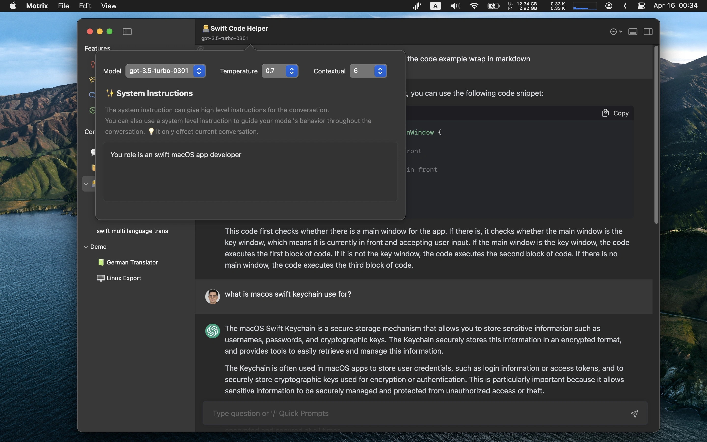

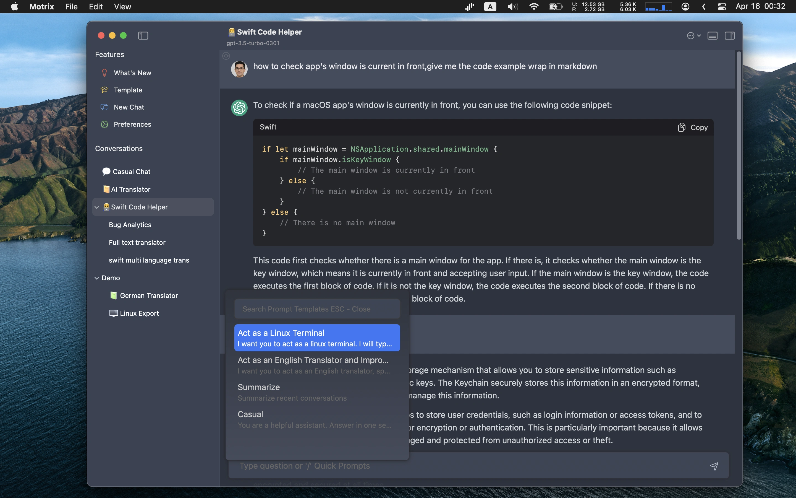

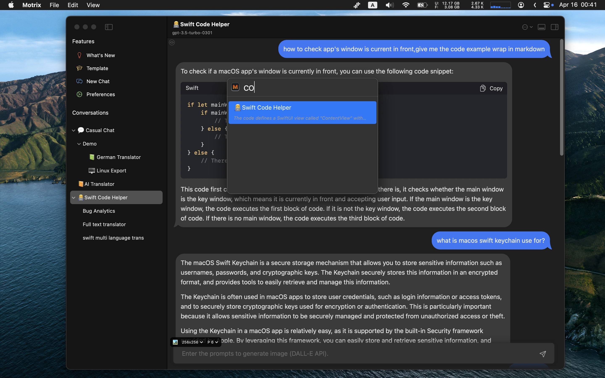

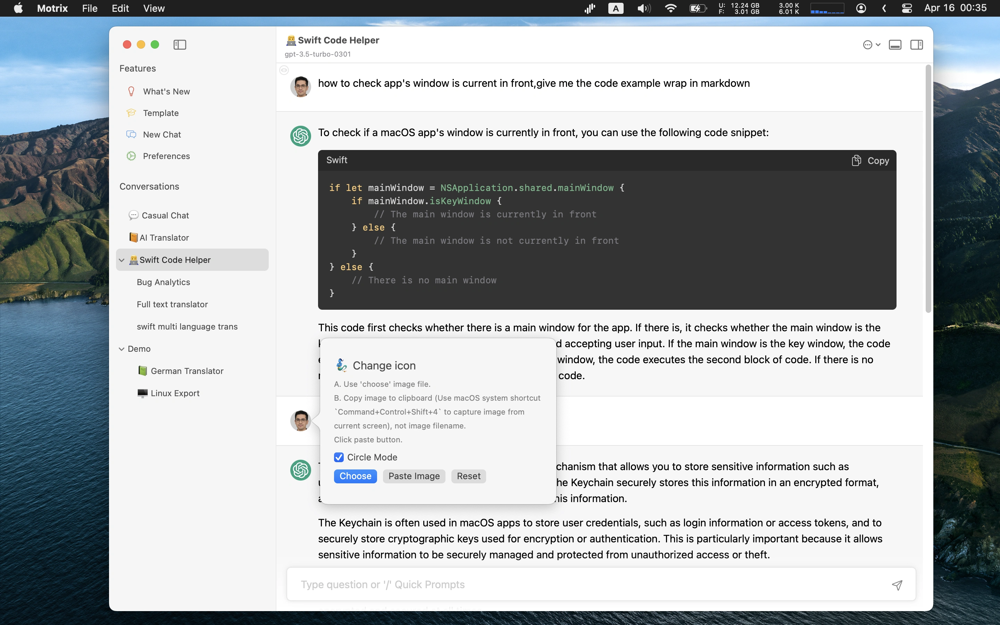

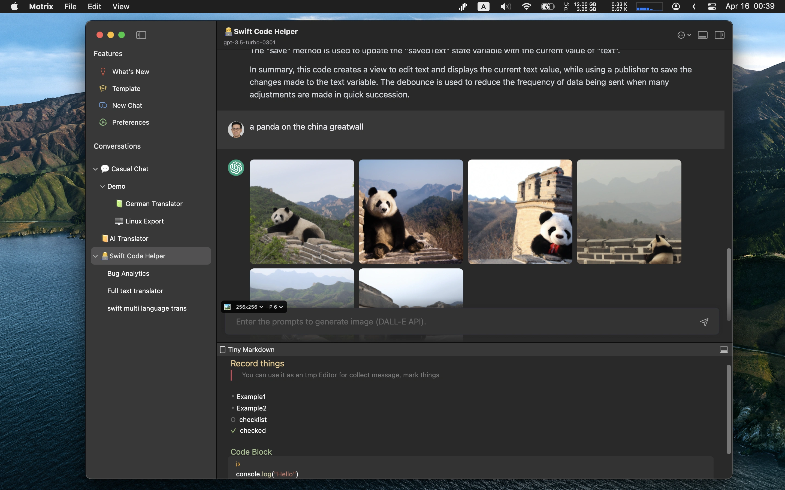

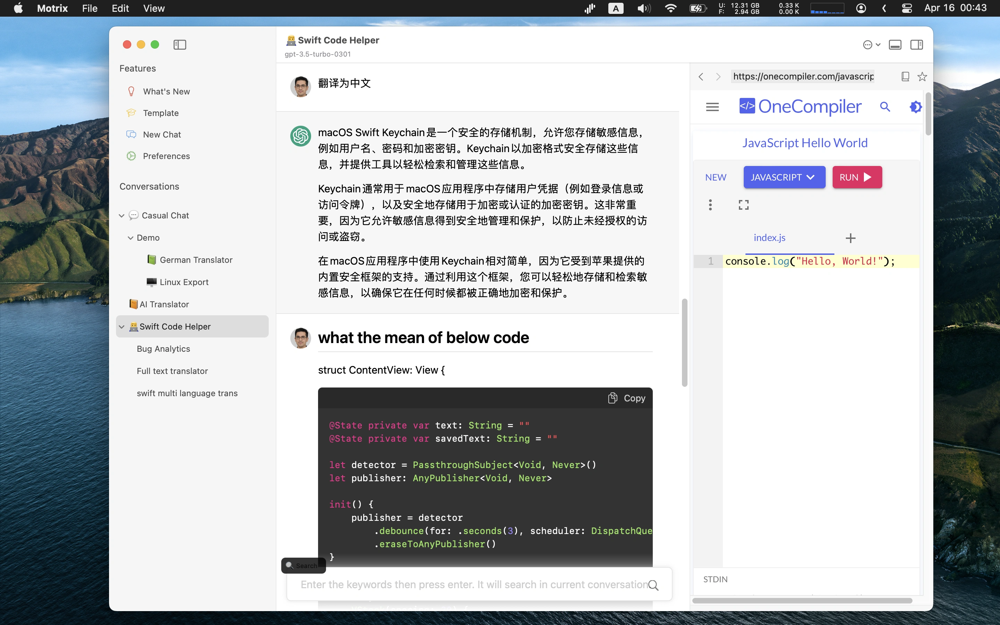

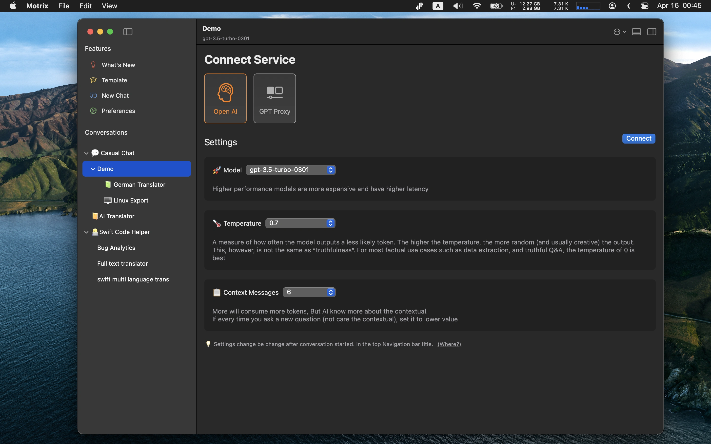

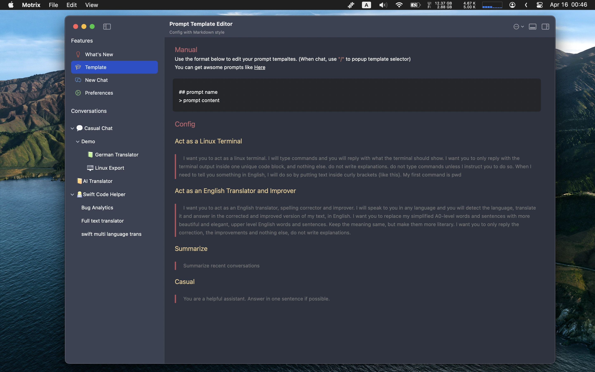

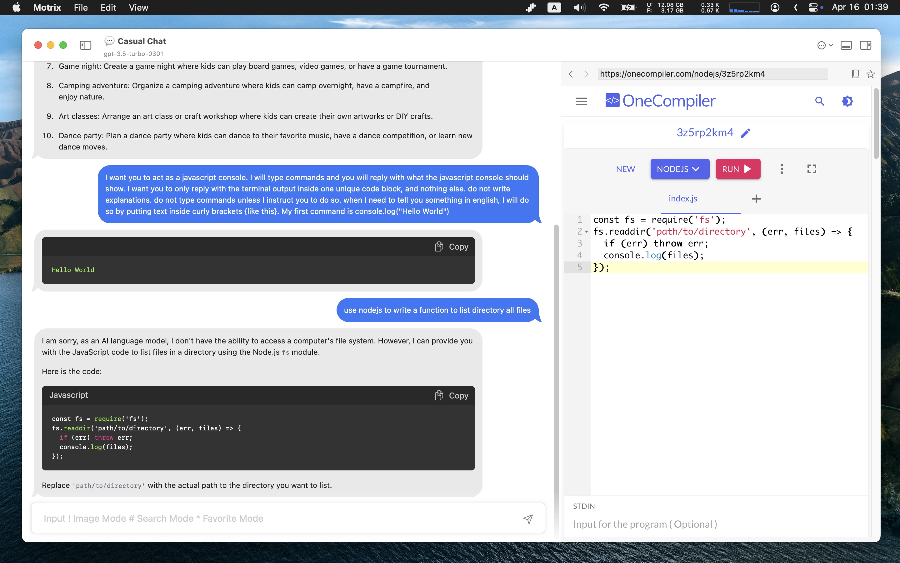

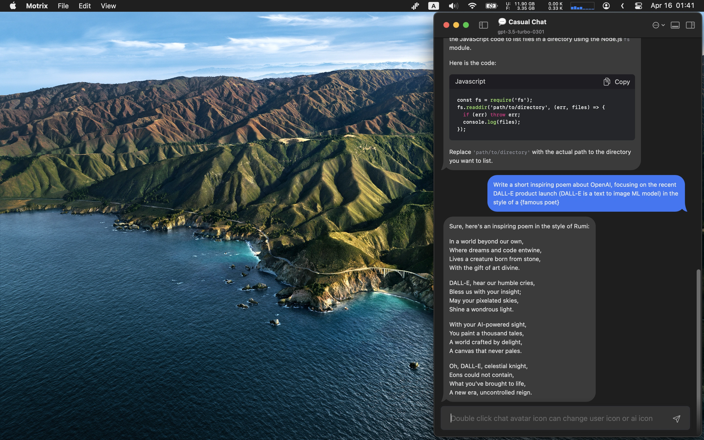

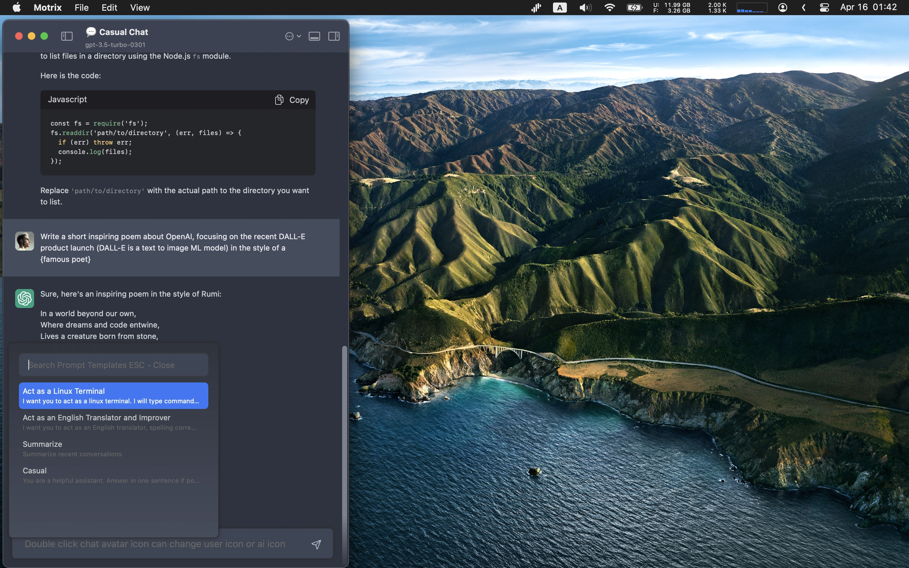

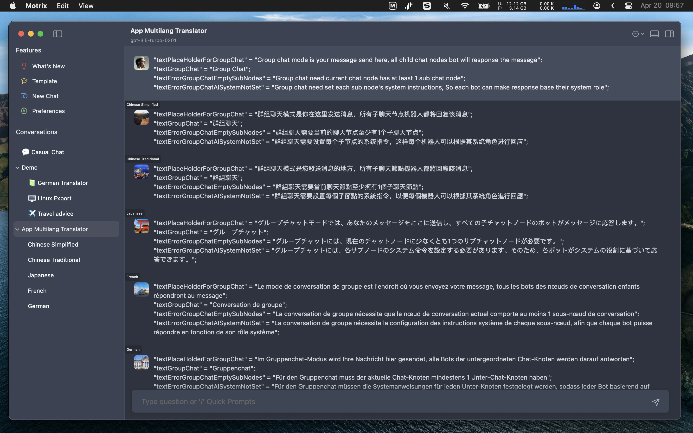