# 🎠 Motrix - macOS native chatGPT client

Download [the latest release from macOS appstore](https://apps.apple.com/us/app/id6447776319)

## Features
- support local LLM proxy litellm
- You must have an GPT API Key to run Motrix App
- Connect chatGPT API or GPT Proxy service (Custom host)
- Group chat support
- Auto retry
- Regenerate response
- Query Image By Enter ! in input box
- Quick Prompt Template popup selector
- Chat nodes can be organize like tree (Drag & Drop)
- Global quick open switch back to chat
- Custom chat nodes show on Menubar 
- Markdown render conversations
- Save favorites chat and query later
- AI visible icon point out how many contextual message AI can read
- Search conversation by keywords
- Embed 3 themes with Light/Dark support
- Embed tiny markdown editor to collect things
- Embed online code playground
- Support change conversation font-size
- Support change model parameters any time
- Stay on top switch
- Multilanguage support

Screenshots

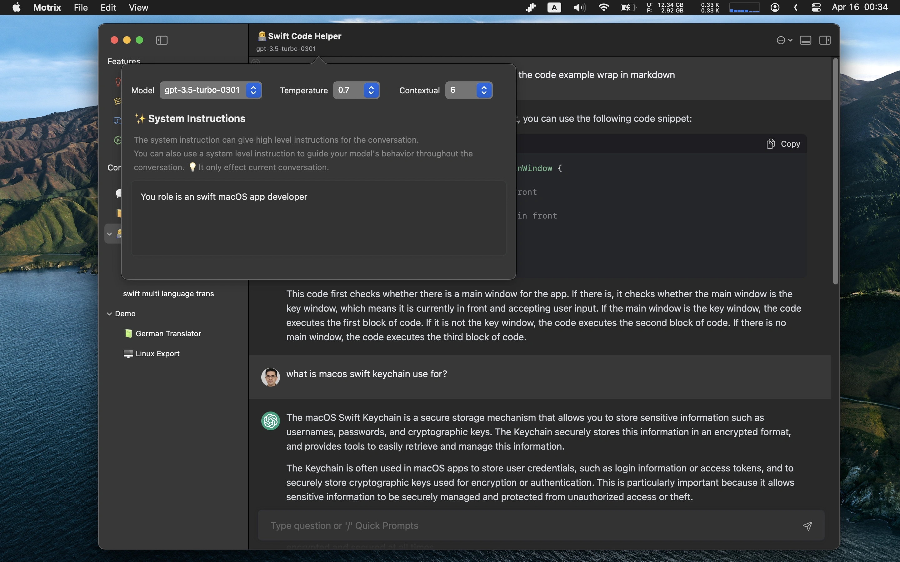

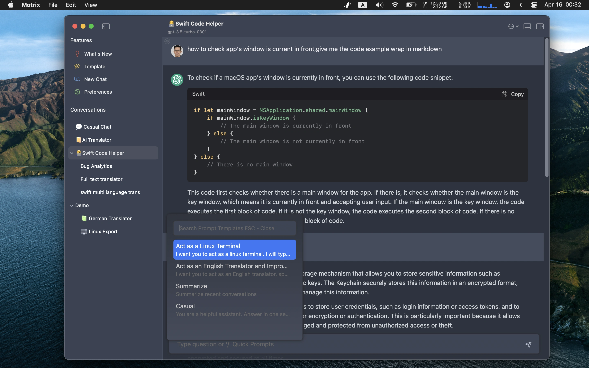

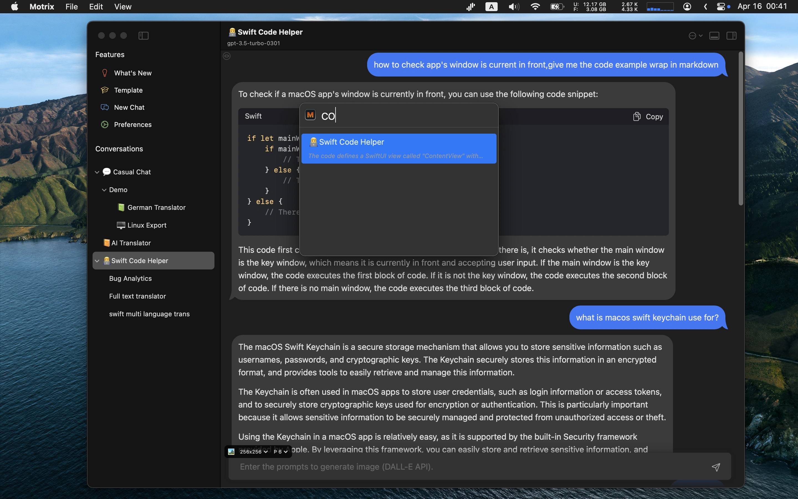

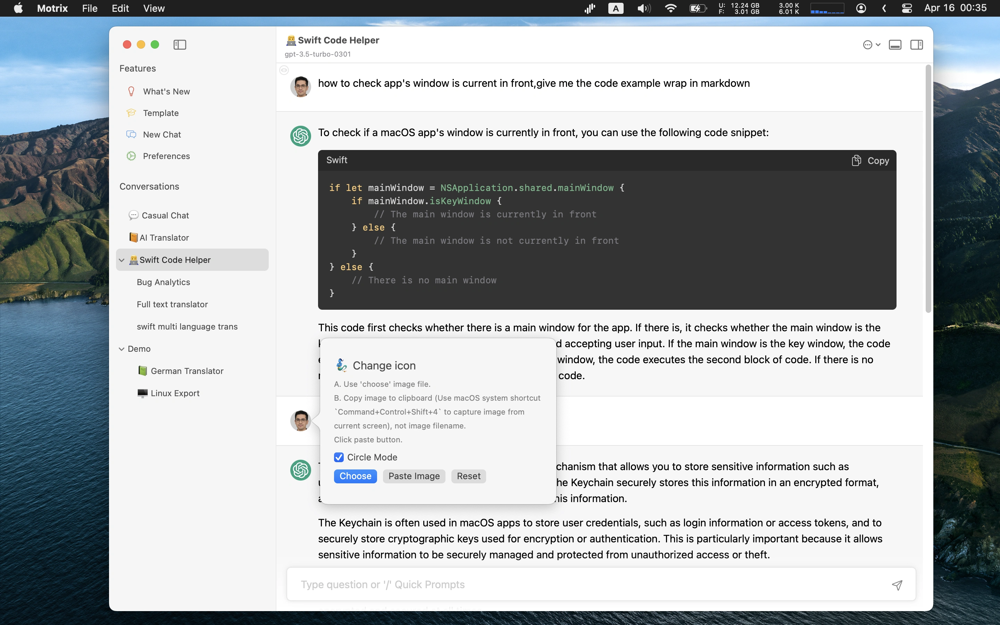

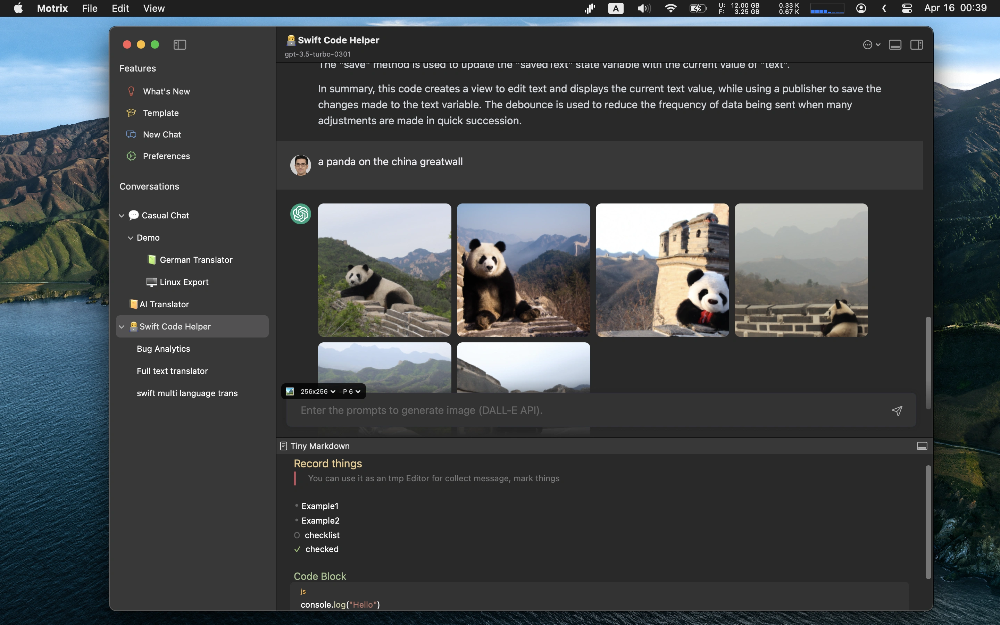

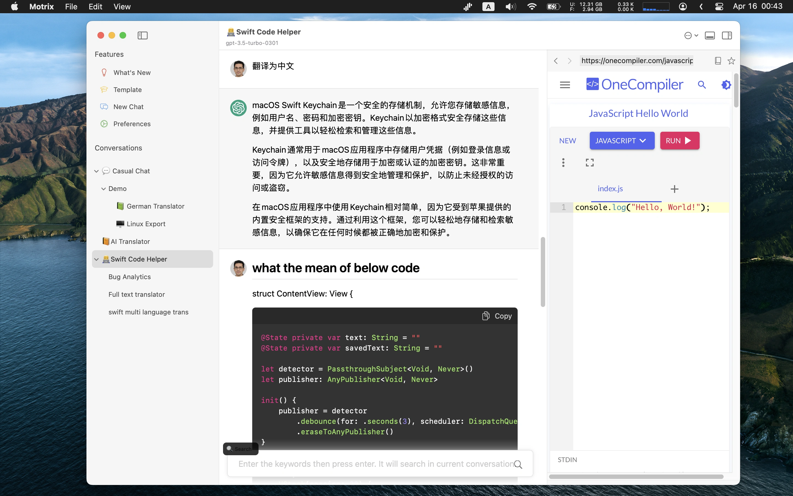

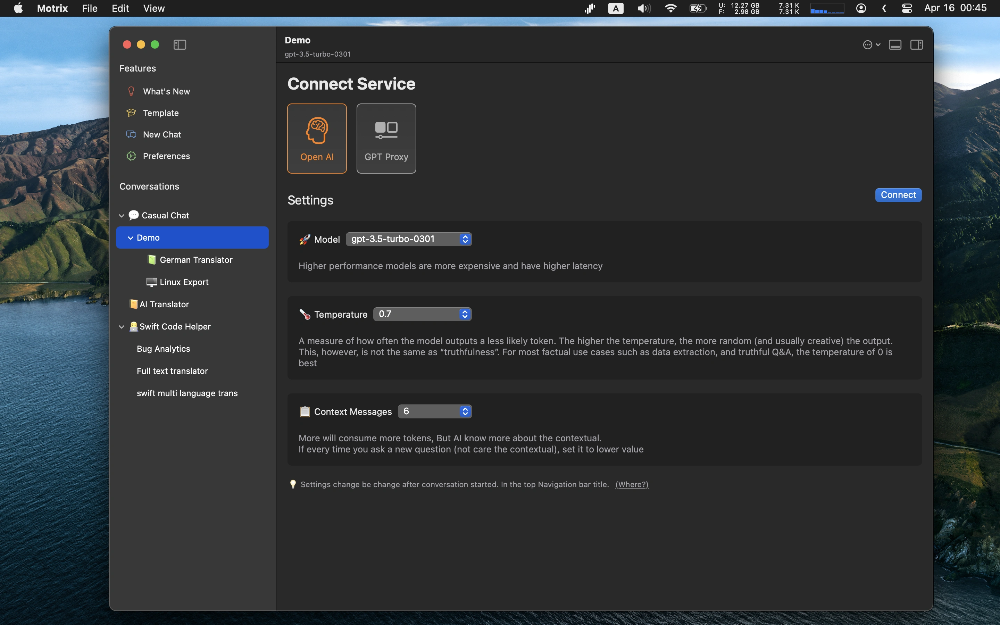

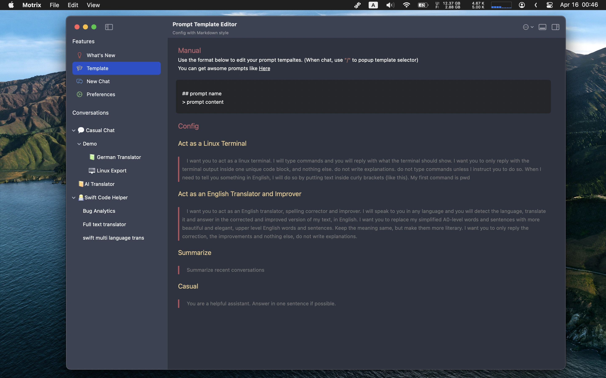

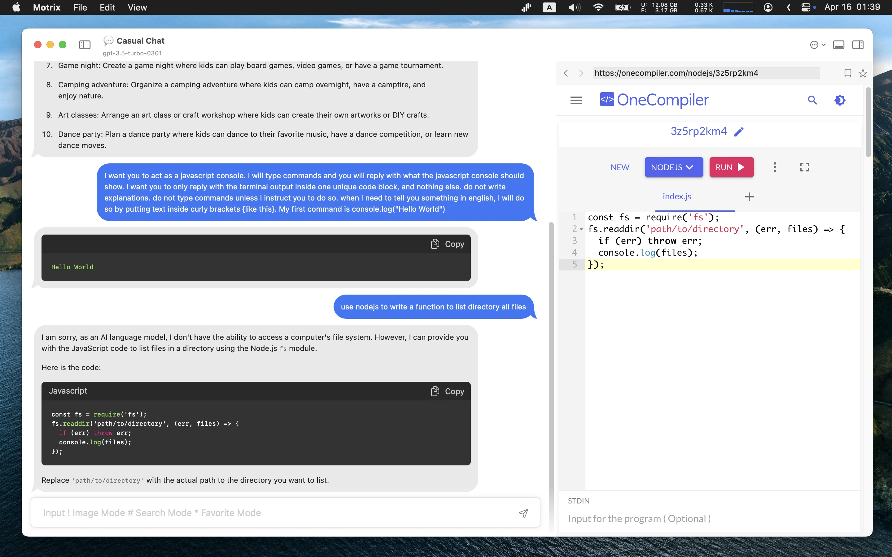

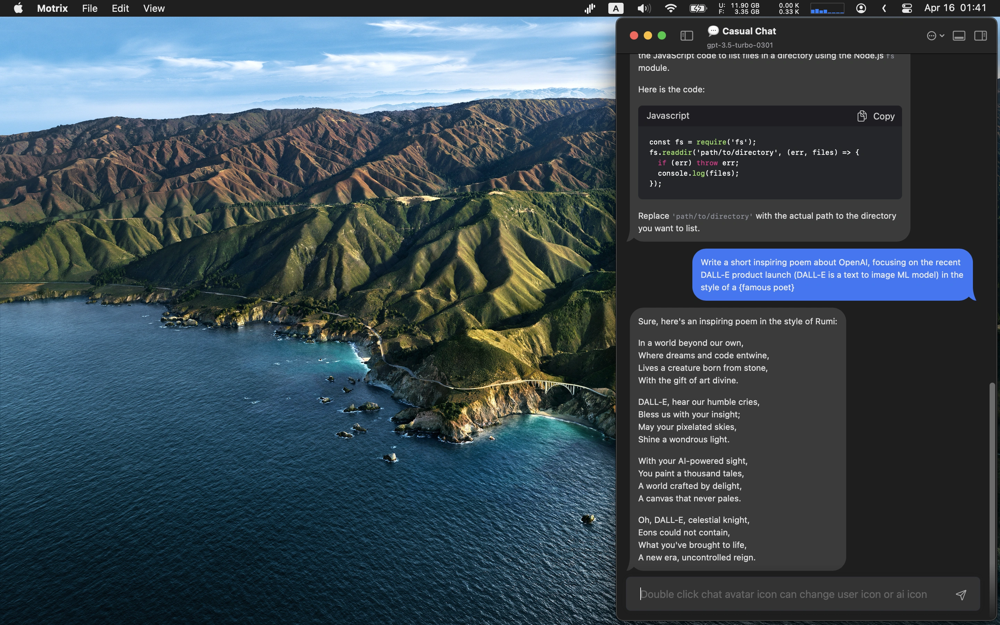

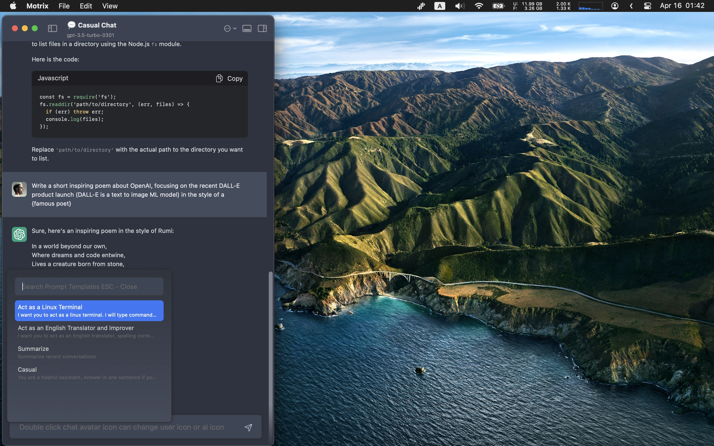

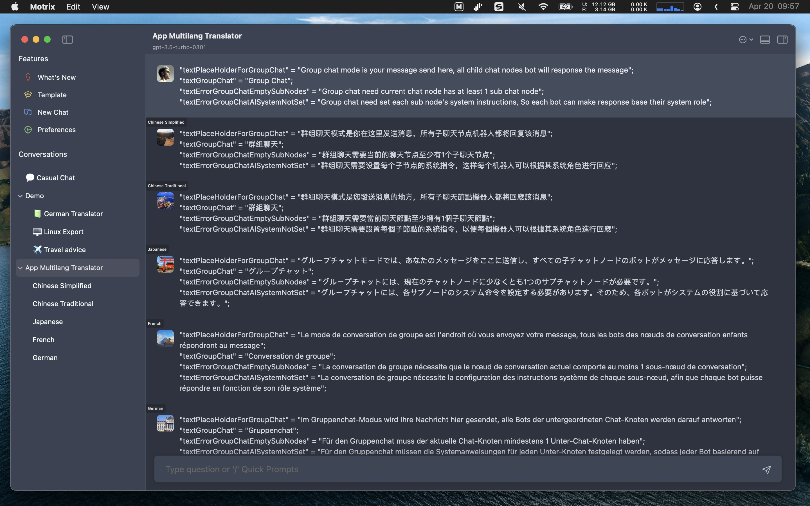
