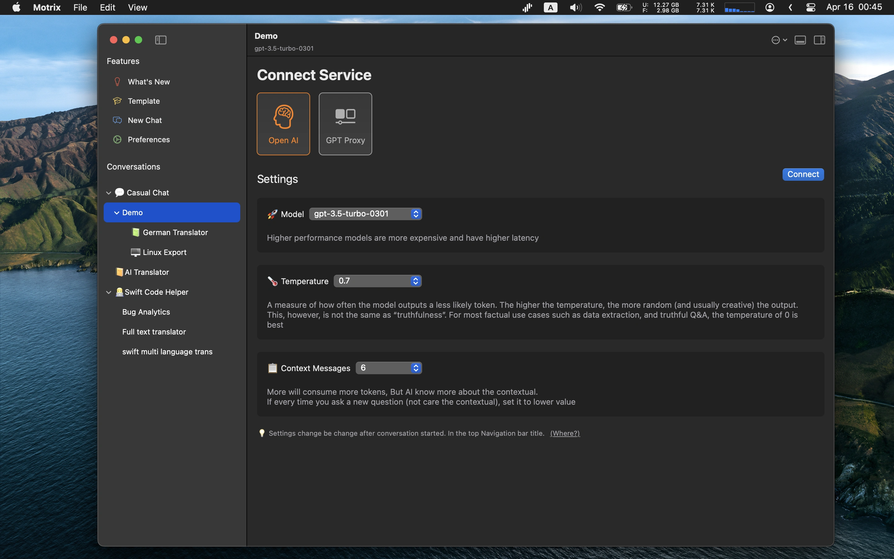

# README.md
- [Deutsch](README.de.md)
- [English](README.md)
- [Spanish](README.es.md)
- [French](README.fr.md)
- [Italian](README.it.md)
- [언어](README.ko.md)
- [日本語](README.ja.md)
- [简体中文](README.zh_cn.md)
- [繁体中文](README.zh_tw.md)

# 🎠 Motrix - macOS原生chatGPT客户端
  
从macOS应用商店[下载最新版本](https://apps.apple.com/us/app/id6447776319)  
  
## 主要特点
- 支持本地LLM代理litellm
- 运行Motrix应用程序需要一个GPT API密钥
- 连接chatGPT API或GPT代理服务（自定义主机）
- 支持群组聊天
- 自动重试
- 快速提示模板弹出选择器
- 聊天节点可以像树一样组织（拖放）
- 全局快速切换回聊天
- 自定义聊天节点显示在菜单栏上
- Markdown渲染对话
- 保存喜爱的聊天信息并稍后查询
- AI可见图标指出AI可以阅读多少个上下文信息
- 根据关键字搜索对话
- 嵌入6个主题，支持浅色/深色
  
V1.9.2  
---  
- 在首选项中添加了备份所有数据并恢复的功能。
- 添加了将消息复制到另一个聊天节点的功能
- 添加了备忘录聊天模式，只保存一些内容，而不向AI服务器发送消息
- 通过使用格式“'@node1;node2;node5 newline translate text”启动新的聊天，作为组聊消息发送临时消息
- 在左侧树节点的上下文菜单中添加了快速临时组聊功能
- 添加了将上下文锁定到行的功能，始终从锁定的上下文行发送对话
- 在快速聊天弹出窗口中添加了双击以编辑计时器的微小功能
- 在滑动条中添加了群组聊天并行线程选项，用于减少对API的并行请求，因为服务器响应问题
- 在快速聊天弹出窗口中添加了直接编辑计时器弹出选项
- 添加了使用快捷方式打开任何聊天节点的选项
- 修复了快速窗口主题样式不匹配的问题
- 修复了流模式无法从开源项目litellm的代理模式读取数据的问题
- [V1.9.2-Uni](https://download.marksdo.com/apps/Motrix/V1.9.2/Motrix.dmg)   
  
  
  
V1.9.1  
---  
- 在快速聊天弹出窗口中添加了双击以编辑计时器的微小功能
- 在快速聊天弹出窗口中添加了直接编辑计时器的选项
- 添加了使用快捷键打开任何聊天节点的选项
- 修复了快速窗口主题样式不匹配的问题
- 修复了流模式无法从开源项目litellm的代理模式读取数据的问题
- [V1.9.1-Uni](https://download.marksdo.com/apps/Motrix/V1.9.1/Motrix.zip)   
  
V1.9.0  
---  
- 添加支持本地部署llm/gpt代理（litellm） http://127.0.0.1:8000作为主机，以支持大多数开源llm/gpt聊天服务器
- 在右上下文菜单中为聊天树节点添加克隆功能
- 添加批量设置节点模型参数的功能（从树中选择多个节点，然后使用上下文菜单->批量设置）
- 修复了系统指令描述无法折叠的问题
- [73.6 MB](https://download.marksdo.com/apps/Motrix/V1.9.0/Motrix.zip)   
  
  
V1.8.9  
---  
- 添加切换到下一个树形聊天节点的快捷方式（与其他系统批量快捷方式应用程序结合使用）
- 在聊天内容的右上下文菜单中添加快照功能。
- 将计划弹出的AI查询结果窗口保存为完整结果图像到剪贴板
- 移除了聊天内容行工具栏。使用右上下文菜单代替
- 修复批量共享聊天内容到图像布局问题
- 修复了在启动时崩溃的问题 macOS 11
- 下载通用版占用空间[73.5MB](https://download.marksdo.com/apps/Motrix/V1.8.9/Motrix.zip)   
  
  
V1.8.7  
---   
- 添加模型密钥配置，您可以在新的模型发布时配置连接模型密钥。
- 添加批量选择聊天行删除功能
- 添加选项以禁用自动滚动到聊天列表底部
- 添加外观配置以更改UI字体大小
- 添加快捷键⌘+(+-)以快速更改聊天内容大小
- 在选项滑块中添加固定输入框高度选项
- 左侧导航栏的大小可以更小
- 新的聊天节点将使用上次选择的聊天节点ai参数
- 修复了计划弹出的自定义ai问题仍然在系统休眠时弹出的问题
- 修复了Markdown渲染选项无法在设置中切换的问题
- 修复了快捷方式应用程序motrix意图问题
  
V1.8.5  
---  
- 增加对新的GPT3.5和GPT4 16K模型的支持
- 增加支持自定义计时器弹出窗口默认宽度的功能（用于长时间响应的日常ai提示）
- 修复了流模式的一些显示问题
- 修复弹出的微小计时器窗口的显示错误
- 修复了macOS11.0的新节点卡住的问题
  
V1.8.4  
---  
- 添加新的聊天指南页面。您可以选择一个预定义的AI角色开始聊天。
- Bug修复和性能改进。
  
V1.8.3  
---  
- 在Motrix Quick服务聊天节点选择器中添加了网格视图
- 添加选项以启用/禁用左树节点中的未读消息
- 添加选项以禁用输入自动滚动
- 修复了通过单击dock栏应用图标无法重新激活到前台的问题
- 修复了一些多语言无法翻译的问题
- 修复了语音模式有时崩溃的问题
  
  
V1.8.2  
---  
- 添加快捷方式应用程序支持（macOS 13.0+）查询AI响应，然后嵌入到您自己的自动化工作流中。您可以在应用程序的首选项中查看如何使用
- Motrix快速服务现在可以选择微小窗口来显示ai响应内容
- 修复了Motrix服务不能显示在浏览器或其他文本应用程序中的问题
  
  
V1.8.1  
---  
- 修复全局搜索有时无法列出数据的问题
- 修复专业计划仍然限制某些功能的问题
- 修复消息 主体高度不适合的问题
  
V1.8  
---  
- 添加每日计时器，自动查询ai聊天节点以弹出激励或动机提示，或者您可以使用它每天自动弹出一条编码提示，语言练习。（双击用户问题行）
- 每日计时器可以直接从Motrix menubar的上下文菜单中调用
- 添加全局快捷键CMD+SHIFT+F快速切换到全局搜索收藏夹
- 修复滚动问题
- 修正了弹出模板选择器有时无法插入文本的问题
- 流模式性能优化
  
  
V1.7 特点  
---  
- 添加浮窗模式，您可以将聊天窗口制作成一个新的小浮动面板
- 支持将文本拖动到聊天窗口的任何区域发送消息
- 添加主工具栏上显示布局切换选项并支持自定义布局还原图标
- 添加Motrix快速系统服务，当在其他编辑器应用程序中选择任何文本时，选择Motrix快速服务将弹出聊天节点选择器并将所选文本发送到聊天系统
- 在消息上添加右键上下文菜单以快速复制、收藏和编辑
- 修复了滚动视图不稳定的问题
- 修复了Markdown换行错误
  
V1.5～1.6 特点  
---  
- 添加流模式，逐个获取响应令牌
- 双击消息行即可编辑嵌入编辑
- 在设置中添加外观配置用于自定义一些UI
- 添加3个支持浅色/深色的新主题
- 添加布局保存和还原功能（包括当前主题、lightDark、字体大小、自动选项...）
- 添加打字动画选项
- 添加os文本服务，在所有其他系统文本编辑器中调用Motrix的api
- 修复并测试Motrix与macOS 11.0、12.0设备的兼容性
- Bug修复和性能改进
  
V1.4 特点  
---  
- 支持在所有对话中搜索
- 支持批量选择模式。选择聊天消息进行分享或导出
- 在所有对话中支持显示收藏夹（在搜索菜单中）
- 自定义每个节点的最大令牌数（您必须知道这些如何工作，如上下文消息，它可以影响ai了解上下文的程度）
- 自定义节点默认进入模式
- Bug修复和性能改进
  
V1.1～V1.3 特点  
---  
- 语音模式：您可以使用麦克风录制文本。应用程序将翻译为文本并保留音频轨道。
- 语音朗读内容：单击用户或机器人头像。
- 群组聊天模式：您可以设置父节点并添加一些子节点（必须使用系统指令初始化AI角色及其角色），然后在父节点中发送消息，所有子节点将在当前对话中给出响应。
- 自动剪贴板：响应时自动将内容复制到剪贴板
- 自动朗读：自动朗读响应
- 自动屏蔽：自动屏蔽ai响应。这主要是为了那些想练习各种语言口语的用户。
  
V1.0 特点  
---  
- 嵌入的Markdown编辑器
- 以树状样式自由分组聊天节点（支持拖放）
- 3个支持浅色/深色的主题
- 代码块颜色渲染
- 保存任何对话以供以后查看或查询
- 对话保存在本地，所以可以离线查看
- 自定义提示模板和快速弹出窗口使用“/”
  
截图  
  
  
  
  
  
  
  
  
  
  
  
  
  
  
  
  
  
  
  
  
  
  
  
