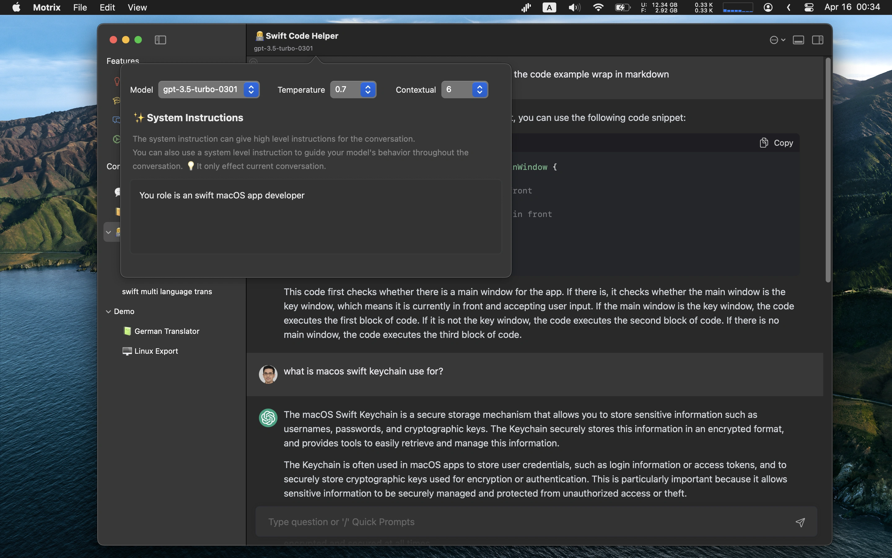
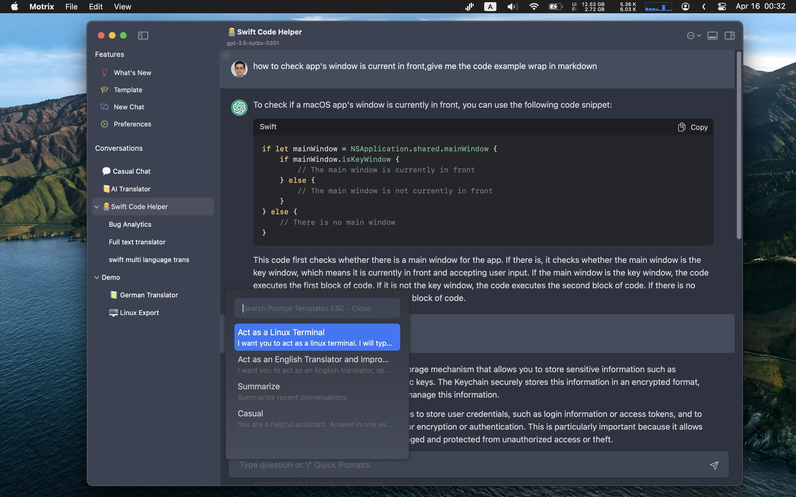

# README.md
- [Deutsch](README.de.md)
- [English](README.md)
- [Spanish](README.es.md)
- [French](README.fr.md)
- [Italian](README.it.md)
- [언어](README.ko.md)
- [日本語](README.ja.md)
- [简体中文](README.zh_cn.md)
- [繁体中文](README.zh_tw.md)

# 🎠 Motrix - macOS原生chatGPT客戶端

從macOS應用商店下載[最新版本](https://apps.apple.com/us/app/id6447776319)

## 主要功能
- 支持本地LLM代理litellm
- 运行Motrix应用程序需要有一个GPT API密钥
- 连接chatGPT API或GPT代理服务（自定义主机）
- 支持群聊
- 自动重试
- 快速提示模板弹出选择器
- 可以像树形结构一样组织聊天节点（拖放）
- 全局快速开关返回到聊天
- 自定义聊天节点显示在菜单栏上
- Markdown渲染会话
- 保存喜爱的聊天记录以便后续查询
- AI可见图标指示AI可以阅读多少上下文消息
- 通过关键字搜索对话
- 嵌入6种带有浅色/深色支持的主题

V1.9.2
---
- 添加备份所有数据并在首选项中恢复的功能。
- 添加将消息复制到另一个聊天节点的功能
- 添加备忘录聊天模式，只保存内容而不发送到AI服务器
- 添加通过以“@node1;node2;node5 newline translate text”格式开始新聊天以将消息作为群聊消息发送的功能
- 通过左侧树节点的上下文菜单添加快速临时群聊
- 添加锁定上下文到行的功能，使对话始终从已锁定的上下文行发送
- 双击以编辑定时器微小弹出聊天窗口以进入编辑器模式
- 在滑动条中添加群聊并行线程选项，用于减少并行请求API导致服务器响应问题
- 在弹出聊天窗口内部直接添加编辑定时器弹出选项
- 添加快捷方式以浮动窗口打开任何聊天节点
- 修复快速窗口主题样式不匹配的问题
- 修复流模式无法在代理模式下从开源项目litellm读取数据的问题
- [V1.9.2-Uni](https://download.marksdo.com/apps/Motrix/V1.9.2/Motrix.dmg)

V1.9.1
---
- 双击以编辑定时器微小弹出聊天窗口以进入编辑器模式
- 在弹出聊天窗口内直接添加编辑定时器弹出选项
- 添加快捷方式以浮动窗口打开任何聊天节点
- 修复快速窗口主题样式不匹配的问题
- 修复流模式无法在代理模式下从开源项目litellm读取数据的问题
- [V1.9.1-Uni](https://download.marksdo.com/apps/Motrix/V1.9.1/Motrix.zip)

V1.9.0
---
- 添加对于llm/gpt代理在本地部署（litellm）的支持，用作支持大多数开源llm/gpt聊天服务器的主机（http://127.0.0.1:8000）
- 在右键菜单中添加聊天树节点的克隆功能
- 添加批量设置节点模型参数的功能（从树形结构中选择多个节点，然后使用右键菜单 -> 批量设置）
- 修复系统指示说明无法折叠的问题
- [73.6 MB](https://download.marksdo.com/apps/Motrix/V1.9.0/Motrix.zip)

V1.8.9
---
- 添加快捷方式切换到下一个树形聊天节点（用于与其他系统批量快捷方式应用程序组合使用）
- 在聊天内容右键菜单中添加快照
- 可以将计划弹出的AI查询结果窗口保存为完整结果图像到剪贴板
- 聊天内容行工具栏已移除。使用右键菜单替代
- 修复批量共享聊天内容到图像布局问题
- 修复启动时在macOS 11上崩溃的问题
- 下载通用版本 [73.5 MB](https://download.marksdo.com/apps/Motrix/V1.8.9/Motrix.zip)

V1.8.7
---
- 添加模型密钥配置。在发布新模型时，可以配置连接模型密钥。
- 添加批量选择聊天行删除功能
- 添加选项以禁用自动滚动到聊天列表底部
- 添加外观配置以更改UI字体大小
- 添加快捷键⌘+(+-)以快速更改聊天内容大小
- 在选项滑块中添加固定输入框高度选项
- 左导航栏大小可以更小
- 新的聊天节点将使用上一次选择的聊天节点AI参数
- 修复计划弹出的自定义AI问题在系统休眠时仍会弹出的问题
- 修复Markdown渲染选项无法在设置中切换的问题
- 修复快捷方式应用程序motrix意图问题

V1.8.5
---
- 添加对新的GPT3.5＆GPT4 16K模型的支持
- 添加支持自定义定时弹出窗口默认宽度的功能（用于长响应日常AI提示）
- 修复了某些情况下流模式显示问题
- 修复微小弹出定时器窗口显示问题
- 修复macOS 11.0的新节点卡住的问题

V1.8.4
---
- 添加新的聊天引导页面。您可以选择一个预定义的AI角色开始聊天。
- 修复错误并改进性能。

V1.8.3
---
- 在Motrix快速服务聊天节点选择器中添加网格视图
- 添加选项以启用/禁用左侧树节点中的未读消息
- 添加选项以禁用打字自动滚动
- 通过单击Dock栏应用程序图标可以重新激活前端
- 修复某些多语言无法翻译的问题
- 修复语音模式有时会崩溃的问题

V1.8.2
---
- 添加快捷方式应用程序支持（macOS 13.0+）查询AI响应，然后将其嵌入到自动工作流程中。您可以在应用程序首选项中查看如何使用。
- Motrix快速服务现在可以选择微小窗口来显示AI响应内容
- 修复Motrix服务无法在浏览器或其他文本应用程序中显示的问题

V1.8.1
---
- 修复全局搜索有时无法列出数据的问题
- 修复专业版仍限制某些功能的问题
- 修复消息正文高度不适合的问题

V1.8
---
- 添加每日定时器以自动查询ai聊天节点以弹出激励或鼓励提示，或者您可以使用它来每天自动弹出编码提示、语言练习（双击用户问题行）
- 每日计时器可以直接从Motrix菜单栏的上下文菜单中调用
- 添加全局快捷键CMD+SHIFT+F快速切换到全局搜索收藏夹
- 修复滚动问题
- 修复弹出模板选择器有时无法插入文本的问题
- 流模式性能改进

V1.7功能
---
- 添加浮动窗口模式，您可以将聊天窗口设置为一个新的小浮动面板
- 支持将文本拖动到聊天窗口的任何区域以发送消息
- 添加显示布局切换到主工具栏选项并支持自定义布局恢复图标
- 添加Motrix快速系统服务，当在其他编辑器应用中选择任何文本时，选择Motrix Quick将弹出聊天节点选择器并将选定的文本发送到聊天系统
- 在消息上添加右键菜单以快速复制、添加收藏和编辑
- 修复滚动视图稳定问题
- 修复Markdown换行符问题

V1.5～1.6功能
---
- 添加流模式，逐个获取响应的令牌
- 通过双击消息行编辑嵌入的消息
- 在设置中添加外观配置以进行一些UI自定义
- 添加3个新的主题，支持浅色和深色
- 添加布局保存和恢复功能（包括当前主题、lightDark、字体大小和自动选项等）
- 添加打字动画选项
- 添加操作系统文本服务，在所有其他系统文本编辑器中调用Motrix的API
- 修复并测试Motrix与macOS 11.0、12.0设备的兼容性
- 修复错误并改进性能

V1.4功能
---
- 支持在所有对话中搜索
- 支持批量选择模式。选择聊天消息进行共享或导出
- 在所有对话中支持显示收藏夹（在搜索菜单中）
- 自定义每个节点的最大令牌数（您必须知道这些如何工作，例如上下文消息，它可能会影响AI知道上下文的程度）
- 自定义节点的默认输入模式
- 修复错误并改进性能

V1.1～V1.3功能
---
- 语音模式：您可以使用麥克風錄製文本。應用程序将翻譯為文本並保留音頻軌道。
- 音樂朗讀內容：單擊用戶或機器人頭像。
- 群聊模式：您可以設置父節點並添加一些子節點（必須使用系統指示來初始化ai角色及其角色），然後在父節點中發送消息，所有子節點都會在當前對話中回應。
- 自動剪貼板：回應時自動將內容複製到剪貼板
- 自動朗讀：自動朗讀回應
- 自動遮罩：自動遮罩ai回應。這主要用於希望練習各種語言口述的用户。

V1.0功能
---
- 嵌入Markdown編輯器
- 自由地使用樹狀結構（支持拖放）進行群聊節點分組
- 3種主題，具有明亮/暗色配色支持
- 代碼塊顏色渲染
- 保存任何對話供以後查看或查詢
- 對話保存在本地，因此可以離線查看
- 自定義提示模板並且可使用“/”快速彈出

屏幕截圖

